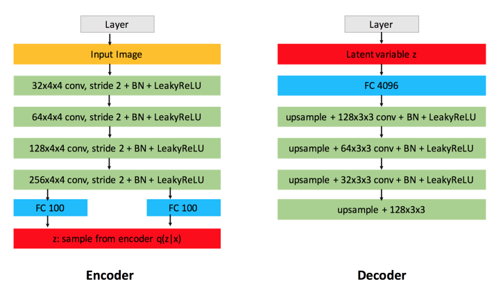
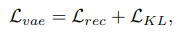
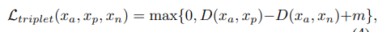

# Stamp Encoding and Generation using Neural Network 
Build a VAE using metric learning, to make stamp embeddings, obtained from encoder, more meaningful, as proposed in this <a href="http://cs231n.stanford.edu/reports/2017/pdfs/108.pdf">paper</a>.  

## Features
⚡ Variational Autoencoder  
⚡ Metric learning  
⚡ Paper implementation  
⚡ PyTorch Lightning  

## Drawbacks
❌ Hard to find balance between metric learning and reconstruction losses  
❌ Perceptual loss does not effectively optimize reconstruction

## Personal additions
✅ Batch Hard Triplet loss strategy was used

## Table of Contents
- [Objective](#objective)
- [Dataset](#dataset)
- [Architecture](#architecture)
- [Solution Approach](#solution-approach)

## Objective
I'll build a neural network using PyTorch. The goal here is to build a variational autoencoder which will map a stamp image into hidden space of lower dimension and then reconstruct it. Despite that, metric learning will be used, so the embedding in hidden space will hold the property that similar ones will be close to each other, while different will be further.

## Dataset
- Dataset consists of 1557 stamp images of 173 different stamps (<a href="https://data.mendeley.com/datasets/ktr99fc826/3">dataset</a>).
- Each image in the dataset is an RGB image of arbitrary size (the average is 120x140) which then are resized to 118x118.

## Architecture
I have implemented the VAE architecture similar to proposed in this <a href="https://link.springer.com/article/10.1134/S1054661822040046">paper</a>. I customized layers to process images of shape 118x118 and used transposed convolutions for upsampling. Here is authors' architecture:

Image is taken from <a href="https://link.springer.com/article/10.1134/S1054661822040046">paper</a>.  

## Evaluation Criteria

### Loss Function  
The Binary CrossEntropy loss function was used as reconstruction loss, KL-divergence loss was used to make distribution tractable. These are basic VAE loss terms. Also, Triplet loss was used to make similar stamps have similar embedding, and different ones - further. Hard batch strategy was used when the positive and negative samples are taken from the hardest ones within the batch.

Images are taken from <a href="https://link.springer.com/article/10.1134/S1054661822040046">paper</a>.

## Solution Approach
- The part of data were collected manually and left part of the dataset was synthesized.
- The dataset was split on training and validation as 80% to 20%.
- The datasets are then wrapped in PyTorch `DataLoader` object so that we can iterate through them with ease. A `batch_size` can be configured.
- Training was held using PyTorch Lightning modules and trainer.
